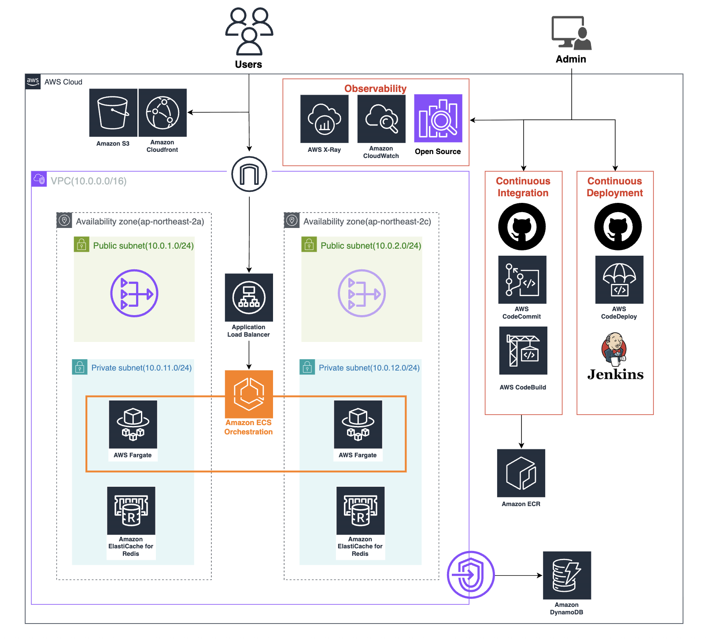

# Softbank 해커톤 실시간 채팅 서비스 AWS Infrastructure


## 프로젝트 개요

이 프로젝트는 Terraform을 사용하여 AWS에서 확장 가능하고 안전한 실시간 채팅 애플리케이션 인프라를 구축합니다

### 주요 기능

- **WebSocket** 실시간 양방향 통신
- **Blue/Green 배포** 전략으로 무중단 업데이트
- 라이브 데모: 트래픽 전환 시연 (90/10 → 50/50 → 10/90)
- **비용 최적화**: 해커톤/개발 환경용 (~$70-90/월)
- 완전 관리형 AWS 서비스
- **멀티 AZ**: Redis 고가용성, ALB 2개 AZ 분산

## 아키텍처

자세한 아키텍처 설명은 [ARCHITECTURE.md](./ARCHITECTURE.md)를 참조하세요.

### 사용된 AWS 서비스

- **컴퓨트**: ECS Fargate, ECS (Orchestration)
- **컨테이너 레지스트리**: ECR (Elastic Container Registry)
- **네트워크**: VPC, ALB (Public), IGW, NAT Gateway, CloudFront
- **데이터베이스**: DynamoDB, ElastiCache Redis (멀티 AZ)
- **스토리지**: S3 (정적 콘텐츠, ALB 로그)
- **보안**: IAM, Security Groups, VPC Endpoints, VPC
- **모니터링**: CloudWatch (알람, 메트릭, 로그), X-ray

### 주요 변경사항
- **리전**: ap-northeast-2 (서울)
- **트래픽 진입**: API Gateway 제거, Public ALB 직접 사용
- **Redis**: 멀티 AZ (프라이머리 + 리드 리플리카)
- **NAT Gateway**: 1개만 사용 (비용 절감)
- **모니터링**: CloudWatch 알람, ALB 액세스 로그

## Prerequisites (사전 요구사항)

### 필수 도구

- [Terraform](https://www.terraform.io/downloads.html) >= 1.0
- [AWS CLI](https://aws.amazon.com/cli/) >= 2.0
- AWS 계정 및 적절한 IAM 권한

### AWS CLI 설정

#### 1. AWS CLI 설치

**macOS (Homebrew)**:
```bash
brew install awscli
```

**Linux**:
```bash
curl "https://awscli.amazonaws.com/awscli-exe-linux-x86_64.zip" -o "awscliv2.zip"
unzip awscliv2.zip
sudo ./aws/install
```

**Windows**:
```powershell
# MSI 인스톨러 다운로드 및 실행
msiexec.exe /i https://awscli.amazonaws.com/AWSCLIV2.msi
```

#### 2. AWS 자격 증명 설정

```bash
aws configure
```

입력 항목:
- **AWS Access Key ID**: IAM 사용자의 Access Key
- **AWS Secret Access Key**: IAM 사용자의 Secret Key
- **Default region name**: `ap-northeast-2` (서울 리전)
- **Default output format**: `json`

자격 증명은 `~/.aws/credentials`에 저장됩니다:
```ini
[default]
aws_access_key_id = YOUR_ACCESS_KEY
aws_secret_access_key = YOUR_SECRET_KEY
```

설정 확인:
```bash
aws sts get-caller-identity
```

#### 3. 프로파일 사용 (옵션)

여러 AWS 계정을 사용하는 경우:
```bash
aws configure --profile softbank
```

Terraform에서 프로파일 사용:
```bash
export AWS_PROFILE=softbank
```

## 프로젝트 구조

```
.
├── README.md                      # 본 파일
├── ARCHITECTURE.md                # 아키텍처 상세 설명
├── DEVELOPER_GUIDE.md             # 개발자 가이드 (DynamoDB, Redis 사용법)
├── QUICKSTART.md                  # 빠른 시작 가이드
├── DEMO_GUIDE.md                  # 해커톤 발표 시연 가이드
├── TEST_GUIDE.md                  # 테스트 가이드
└── terraform/
    ├── main.tf                    # 메인 설정
    ├── variables.tf               # 변수 정의
    ├── outputs.tf                 # 출력값
    ├── versions.tf                # Provider 버전
    ├── terraform.tfvars.example   # 변수값 예제
    └── modules/
        ├── vpc/                   # VPC 모듈 (IGW, NAT, Subnets)
        ├── security-groups/       # Security Groups
        ├── iam/                   # IAM Roles
        ├── ecr/                   # ECR Repository
        ├── dynamodb/              # DynamoDB 테이블
        ├── elasticache/           # Redis 클러스터 (멀티 AZ)
        ├── alb/                   # ALB (Public, 액세스 로그)
        ├── ecs/                   # ECS Cluster & Fargate Services
        ├── monitoring/            # CloudWatch 알람, 로그
        └── cloudfront/            # CloudFront + S3
```

## 시작하기

### 1. 저장소 클론

```bash
git clone <repository-url>
cd softbank-infrastructure
```

### 2. Terraform 변수 설정

```bash
cd terraform
cp terraform.tfvars.example terraform.tfvars
```

`terraform.tfvars` 파일을 편집하여 필요한 값을 설정:

```hcl
# AWS 기본 설정
aws_region   = "ap-northeast-2"  # 서울 리전
project_name = "chatapp"
environment  = "dev"

# 컨테이너 이미지 (ECR URL은 terraform apply 후 자동 생성됨)
# 처음에는 기본값(nginx:latest) 사용, 이후 ECR 이미지로 변경
container_image = "nginx:latest"

# S3 버킷 이름 (고유한 이름으로 변경, 비워두면 자동 생성)
s3_bucket_name = ""
```

### 3. Terraform 초기화

```bash
terraform init
```

### 4. 인프라 계획 확인

```bash
terraform plan
```

### 5. 인프라 배포

```bash
terraform apply
```

배포 확인 메시지가 나타나면 `yes`를 입력합니다.

**배포 소요 시간**: ~10-15분

### 6. 출력값 확인

배포가 완료되면 다음과 같은 출력값을 확인할 수 있습니다:

```bash
terraform output
```

주요 출력값:
- `ecr_repository_url`: ECR Repository URL (Docker 이미지 푸시용)
- `alb_dns_name`: ALB DNS 이름 (사용자 직접 접속)
- `cloudfront_domain_name`: 정적 웹사이트 도메인
- `redis_endpoint`: Redis 엔드포인트

### 7. 연결 테스트

**ALB 헬스 체크**:
```bash
# Blue 타겟 그룹 상태 확인
aws elbv2 describe-target-health \
  --target-group-arn $(terraform output -raw blue_target_group_arn) \
  --region ap-northeast-2 \
  --query 'TargetHealthDescriptions[*].TargetHealth.State'

# 예상 출력: ["healthy"]
```

**완전한 테스트 가이드**: [TEST_GUIDE.md](./TEST_GUIDE.md) 참조

## DynamoDB 테이블 구조

### 테이블 개요

이 프로젝트는 3개의 DynamoDB 테이블을 사용합니다:

1. **Messages** (`chatapp-dev-messages`): 채팅 메시지 저장
2. **Connections** (`chatapp-dev-connections`): WebSocket 연결 정보
3. **User Counter** (`chatapp-dev-user-counter`): 자동 증가 사용자 ID 관리

### 상세 스키마 및 사용법

자세한 테이블 구조, 쿼리 예제, Redis 캐시 사용법은 [DEVELOPER_GUIDE.md](./DEVELOPER_GUIDE.md)를 참조하세요.

#### 간단 요약

**Messages 테이블**:
- Partition Key: `roomId` (채팅방 ID)
- Sort Key: `timestamp` (메시지 시간)
- GSI: `userId-timestamp-index` (사용자별 메시지 조회)

**Connections 테이블**:
- Partition Key: `connectionId` (WebSocket 연결 ID)
- GSI: `userId-index` (사용자별 연결 조회)

**User Counter 테이블**:
- Partition Key: `counterId` (카운터 식별자)
- Atomic counter로 사용자 ID 자동 생성

## 배포 후 작업

### 1. Docker 이미지 빌드 및 푸시

실제 채팅 애플리케이션 이미지를 ECR에 푸시해야 합니다:

```bash
# ECR Repository URL 확인
ECR_REPO=$(terraform output -raw ecr_repository_url)
echo "ECR Repository: $ECR_REPO"

# ECR 로그인
aws ecr get-login-password --region ap-northeast-2 | docker login --username AWS --password-stdin $ECR_REPO

# 이미지 빌드 (채팅 애플리케이션 소스 디렉토리에서)
docker build -t chatapp:latest .

# 태그 지정
docker tag chatapp:latest $ECR_REPO:latest

# 푸시
docker push $ECR_REPO:latest

# terraform.tfvars에서 container_image 업데이트
# container_image = "<ECR_REPO_URL>:latest"
```

### 2. ECS 서비스 업데이트

새 이미지를 배포하려면:

```bash
aws ecs update-service \
  --cluster chatapp-dev-cluster \
  --service chatapp-dev-service-blue \
  --region ap-northeast-2 \
  --force-new-deployment
```

### 3. 정적 웹사이트 배포

S3에 정적 파일 업로드:

```bash
aws s3 sync ./frontend/build s3://<bucket-name>/ --region ap-northeast-2
```

CloudFront 캐시 무효화:

```bash
aws cloudfront create-invalidation \
  --distribution-id <distribution-id> \
  --paths "/*"
```

## 해커톤 라이브 데모 (4분 프레젠테이션)

### 데모 전 준비 (프레젠테이션 시작 전)

1. **인프라 배포** (~10분):
   ```bash
   cd terraform
   terraform apply
   ```

2. **Blue/Green 환경 모두 정상 확인**:
   ```bash
   # Blue 서비스 확인
   aws ecs describe-services \
     --cluster chatapp-dev-cluster \
     --services chatapp-dev-service-blue \
     --region ap-northeast-2 \
     --query 'services[0].runningCount'

   # Green 서비스 확인
   aws ecs describe-services \
     --cluster chatapp-dev-cluster \
     --services chatapp-dev-service-green \
     --region ap-northeast-2 \
     --query 'services[0].runningCount'
   ```
   둘 다 `1`을 반환해야 합니다.

3. **청중에게 URL 공유** (데모 5분 전)
   ```bash
   terraform output alb_dns_name
   # 또는
   terraform output cloudfront_domain_name
   ```

### 라이브 데모 스크립트

**0-1분**: 현재 상태 보여주기
```bash
terraform output blue_weight  # 출력: 90
terraform output green_weight  # 출력: 10
```

**1-2분**: 50/50으로 전환
```bash
# terraform.tfvars 편집
blue_weight  = 50
green_weight = 50

terraform apply -auto-approve
```

**2-3분**: Green-우세로 전환
```bash
# terraform.tfvars 편집
blue_weight  = 10
green_weight = 90

terraform apply -auto-approve
```

**3-4분**: 연결 끊김 없음 확인
- 청중에게 질문: "연결이 끊긴 분 계신가요?"
- CloudWatch 메트릭 보여주기

**전체 데모 스크립트**: [DEMO_GUIDE.md](./DEMO_GUIDE.md) 참조

### 긴급 롤백

데모 중 문제 발생 시:
```bash
# Blue 100%로 즉시 롤백
terraform apply -var="blue_weight=100" -var="green_weight=0" -auto-approve
```

## 모니터링

### CloudWatch Logs

ECS 로그 확인:
```bash
aws logs tail /ecs/chatapp-dev --follow --region ap-northeast-2
```

### CloudWatch Metrics

AWS 콘솔에서 다음 메트릭 확인:
- ECS Service CPU/Memory 사용률
- ALB Request Count, Target Response Time
- ALB 4xx/5xx 에러율
- DynamoDB Read/Write Capacity
- ElastiCache CPU, Network I/O

### CloudWatch Alarms

다음 알람이 자동으로 생성됩니다:
- ALB Unhealthy Hosts
- ALB 4xx Errors
- ALB 5xx Errors
- ALB Target Response Time (P95)

## 비용 예상

**해커톤 최적화 구성** (서울 리전):

### 리소스 별 비용 분석
- **ECS Fargate**: ~$15-20/월
  - Blue: 1 task (0.25 vCPU, 0.5 GB)
  - Green: 1 task (0.25 vCPU, 0.5 GB)
- **ALB**: ~$20-25/월 (단일 ALB)
- **NAT Gateway**: ~$32/월 (1개만 사용, 비용 최적화)
- **ElastiCache (t4g.micro)**: ~$15/월 (멀티 AZ: 프라이머리 + 리플리카)
- **DynamoDB (On-Demand)**: ~$5/월 (낮은 트래픽)
- **CloudFront**: ~$1/월 (최소 트래픽)
- **S3**: ~$1/월 (정적 콘텐츠 + ALB 로그)
- **VPC, Security Groups**: 무료

**총 예상 비용**: ~$70-90/월

### 프로덕션 대비 비용 절감
| 항목 | 프로덕션 | 해커톤 | 절감액 |
|------|-----------|-----------|---------|
| NAT Gateway | 2 AZs | 1 AZ | ~$32/월 |
| ECS Tasks | 4+ tasks | 2 tasks | ~$30/월 |
| ElastiCache | 단일 노드 | 멀티 AZ | $0 (가용성 우선) |
| 백업 | 활성화 | 비활성화 | ~$10/월 |
| **총 절감액** | | | **~$72/월** |

### 추가 비용 절감 팁
1. **데모 외 시간에 중지**: ECS 태스크를 0으로 스케일링
2. **Fargate Spot 사용**: ~70% 저렴 (단, 중단 가능)
3. **해커톤 후 삭제**: `terraform destroy` 실행!

## 리소스 정리

**중요**: 해커톤 종료 후 지속적인 과금을 피하기 위해 모든 리소스를 삭제하세요!

### 빠른 정리

```bash
# 1. S3 버킷 비우기 (필수)
aws s3 rm s3://$(terraform output -raw s3_bucket_name) --recursive --region ap-northeast-2

# 2. 모든 인프라 삭제
cd terraform
terraform destroy -auto-approve
```

### 삭제 확인

```bash
# ECS 클러스터 확인
aws ecs list-clusters --region ap-northeast-2

# ALB 확인
aws elbv2 describe-load-balancers --region ap-northeast-2

# NAT Gateway 확인
aws ec2 describe-nat-gateways --filter "Name=state,Values=available" --region ap-northeast-2
```

**예상 소요 시간**: ~10분

### 비용 알림

삭제를 잊으면 월 ~$70-90의 요금이 계속 청구됩니다. CloudWatch 요금 알람 설정을 권장합니다!

## 문제 해결

### Terraform 초기화 오류

```bash
rm -rf .terraform .terraform.lock.hcl
terraform init
```

### AWS 자격 증명 오류

```bash
aws configure list
aws sts get-caller-identity
```

### ECS 태스크 시작 실패

CloudWatch Logs에서 오류 확인:
```bash
aws logs tail /ecs/chatapp-dev --follow --region ap-northeast-2
```

## 참고 자료

- [Terraform AWS Provider](https://registry.terraform.io/providers/hashicorp/aws/latest/docs)
- [AWS ECS Best Practices](https://docs.aws.amazon.com/AmazonECS/latest/bestpracticesguide/intro.html)
- [ALB WebSocket Support](https://docs.aws.amazon.com/elasticloadbalancing/latest/application/load-balancer-target-groups.html)
- [DynamoDB Best Practices](https://docs.aws.amazon.com/amazondynamodb/latest/developerguide/best-practices.html)
- [ElastiCache Redis Multi-AZ](https://docs.aws.amazon.com/AmazonElastiCache/latest/red-ug/AutoFailover.html)
